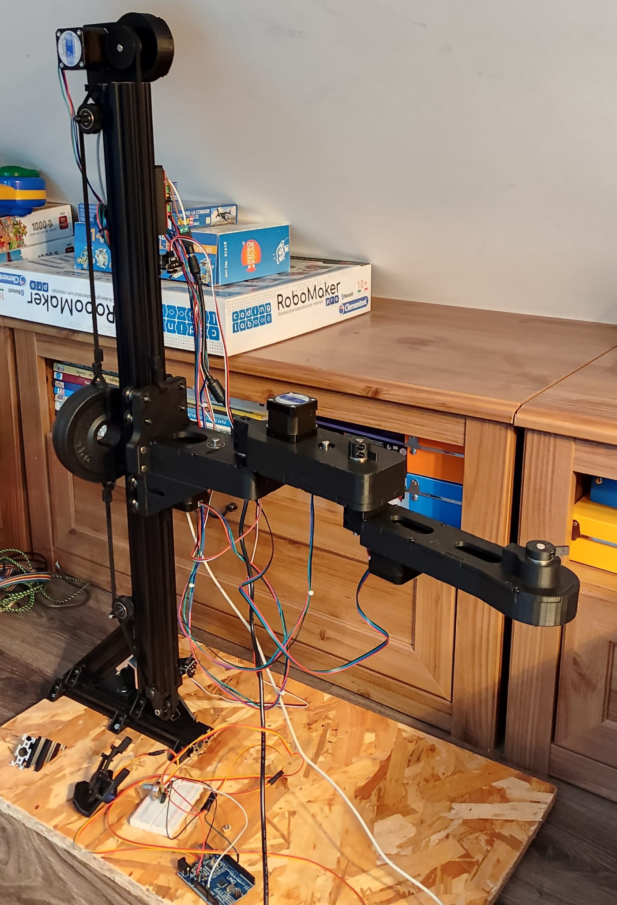

# Bras robot qui joue au echec

## 1. Bras robot 6 axes

### Video test bras robot

<iframe width="560" height="315" src="https://www.youtube.com/embed/7l4egNXn1Wg?si=j_Jjd0feub_97iSB" title="YouTube video player" frameborder="0" allow="accelerometer; autoplay; clipboard-write; encrypted-media; gyroscope; picture-in-picture; web-share" referrerpolicy="strict-origin-when-cross-origin" allowfullscreen></iframe>

### Video avec Logiciel de controle du bras robot

<iframe width="560" height="315" src="https://www.youtube.com/embed/ky7fsqnJq0o?si=hvbOnP_kcds6W_dR" title="YouTube video player" frameborder="0" allow="accelerometer; autoplay; clipboard-write; encrypted-media; gyroscope; picture-in-picture; web-share" referrerpolicy="strict-origin-when-cross-origin" allowfullscreen></iframe>

## 2. Bras robot 4 axes

{ width="300"}

